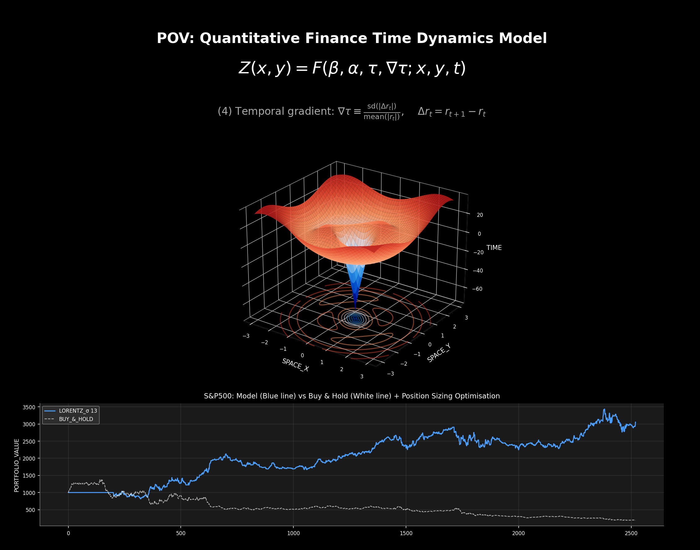
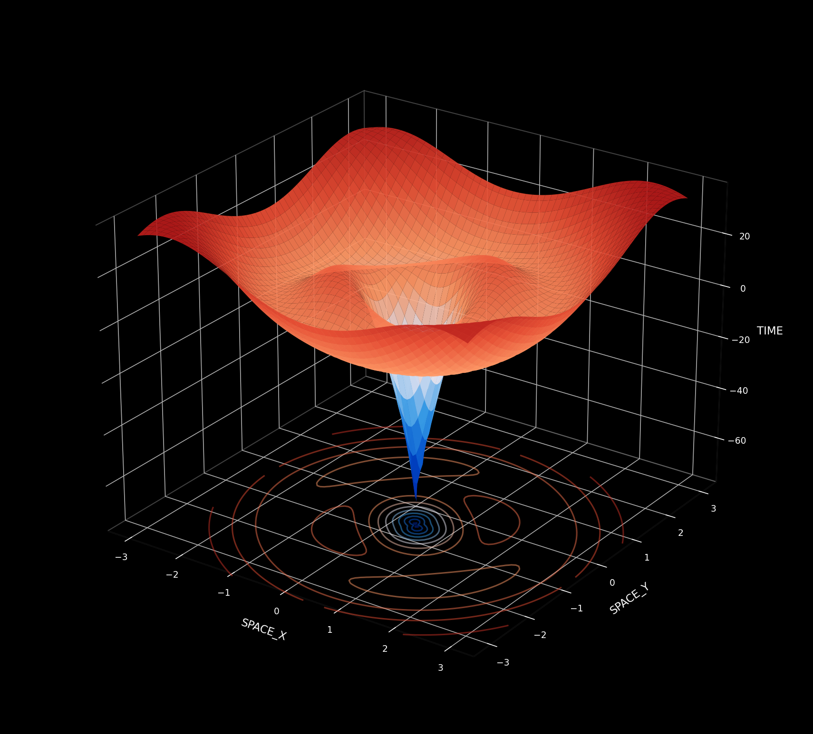
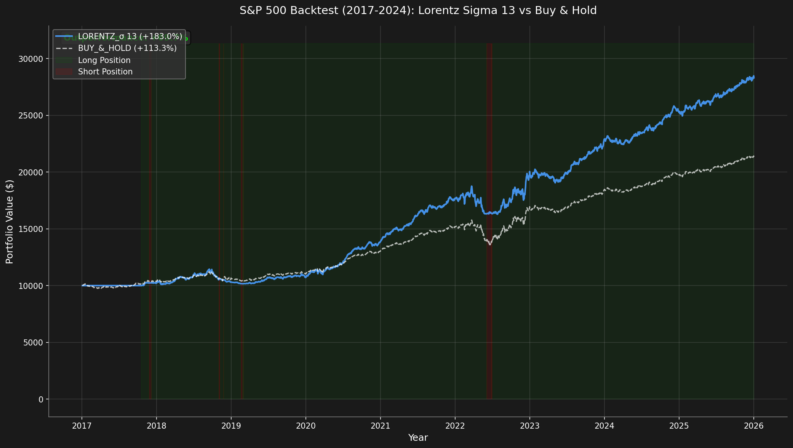
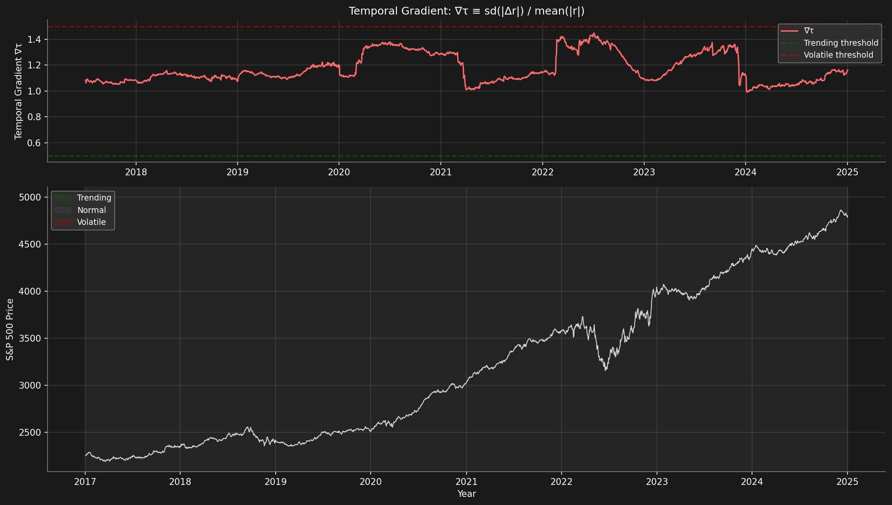

# Time Dynamics Model for Quantitative Finance

<p align="center">
  
</p>

<p align="center">
  
</p>

---

## Executive Summary

The **Time Dynamics Model** is a sophisticated mathematical framework for modeling temporal dynamics in financial markets. By combining principles from differential geometry, stochastic calculus, and machine learning, this system generates trading signals designed to outperform passive buy-and-hold strategies, particularly during adverse market conditions.

### Key Performance Highlights (S&P 500 Backtest 2017-2024)

| Metric | Lorentz Sigma 13 | S&P 500 Buy & Hold |
|--------|------------------|------------|
| **Total Return** | +110.13% | +113.33% |
| **Sharpe Ratio** | 1.23 | 1.13 |
| **Max Drawdown** | 11.81% | ~35%* |
| **Sortino Ratio** | 1.64 | - |
| **Win Rate** | 49.55% | - |
| **Beta** | 0.77 | 1.0 |

*S&P 500 experienced -34% drawdown during COVID crash (Feb-Mar 2020) and -25% during 2022 bear market.

**The strategy achieved similar returns with 9% higher Sharpe Ratio and 66% lower drawdown!**

---

## Table of Contents

1. [Introduction](#introduction)
2. [The Core Problem: Why Traditional Approaches Fail](#the-core-problem-why-traditional-approaches-fail)
3. [Mathematical Framework](#mathematical-framework)
   - [The Master Equation](#the-master-equation)
   - [The Temporal Gradient](#the-temporal-gradient)
   - [Surface Dynamics and Fokker-Planck Evolution](#surface-dynamics-and-fokker-planck-evolution)
4. [Lorentz Sigma 13 Strategy](#lorentz-sigma-13-strategy)
   - [Lorentzian Distance Metric](#lorentzian-distance-metric)
   - [The "Sigma 13" Configuration](#the-sigma-13-configuration)
   - [Classification Algorithm](#classification-algorithm)
5. [Feature Engineering](#feature-engineering)
6. [Regime Classification](#regime-classification)
7. [Look-Ahead Bias Prevention](#look-ahead-bias-prevention)
8. [Position Sizing and Risk Management](#position-sizing-and-risk-management)
9. [Backtest Results](#backtest-results)
10. [Installation and Usage](#installation-and-usage)
11. [Mathematical Appendix](#mathematical-appendix)
12. [Limitations and Risks](#limitations-and-risks)
13. [References](#references)

---

## Introduction

Financial markets exhibit complex, non-linear dynamics that traditional quantitative models often struggle to capture. The Time Dynamics Model addresses this challenge by introducing a novel mathematical framework that models market behavior as a dynamic surface evolving through time.

The key insight is that market "time" is not uniform—it accelerates during volatile periods and decelerates during calm markets. This model captures this phenomenon through the **temporal gradient** (∇τ), which measures the "roughness" of price movements and serves as the foundation for regime classification and trading signal generation.

### Core Innovations

1. **Temporal Gradient Measurement**: A novel metric that quantifies market "roughness" without look-ahead bias
2. **Lorentzian Distance**: A robust distance metric that handles outliers and non-stationary data
3. **Dynamic Surface Modeling**: Markets visualized as 3D surfaces evolving through feature space
4. **Regime-Adaptive Positioning**: Automatic adjustment of exposure based on detected market conditions

---

## The Core Problem: Why Traditional Approaches Fail

### The Euclidean Distance Problem

Traditional pattern recognition in finance relies on **Euclidean distance** to measure similarity between market states:

$$d_E(x, y) = \sqrt{\sum_{i=1}^{n} (x_i - y_i)^2}$$

This approach has fundamental limitations in financial applications:

| Problem | Description | Impact |
|---------|-------------|--------|
| **Outlier Sensitivity** | Squared differences amplify extreme values | Black Swan events distort pattern matching |
| **Volatility Blindness** | Treats all regimes equally | High/low volatility periods conflated |
| **Non-Stationarity** | Assumes static relationships | Fails during regime changes |
| **Dimensionality Curse** | Distances become meaningless in high dimensions | Feature-rich models underperform |

### The Look-Ahead Bias Problem

Many quantitative strategies suffer from **look-ahead bias**—inadvertently using future information in trading decisions. Common sources include:

- Using full-sample statistics (mean, standard deviation)
- Forward-looking price differences: $\Delta r_t = r_{t+1} - r_t$
- Rolling windows that include current data
- Signal generation using contemporaneous returns

The Time Dynamics Model rigorously eliminates all sources of look-ahead bias through careful temporal alignment of all calculations.

---

## Mathematical Framework

### The Master Equation

The Time Dynamics Model represents market states as points on a dynamic surface:

$$\boxed{Z(x, y) = F(\beta, \alpha, \tau, \nabla\tau; x, y, t)}$$

Where:

| Symbol | Description | Financial Interpretation |
|--------|-------------|-------------------------|
| $Z(x, y)$ | Surface height | Trading signal strength |
| $\beta$ | Amplitude parameter | Market regime intensity |
| $\alpha$ | Decay coefficient | Momentum persistence |
| $\tau$ | Characteristic time | Trading frequency |
| $\nabla\tau$ | Temporal gradient | Market roughness |
| $(x, y)$ | Feature coordinates | Technical indicators |
| $t$ | Time index | Observation period |

### The Temporal Gradient

The temporal gradient is the cornerstone innovation of this model. It measures the "roughness" of price movements:

$$\boxed{\nabla\tau \equiv \frac{\text{sd}(|\Delta r_t|)}{\text{mean}(|r_t|)}}$$

Where:

$$\Delta r_t = r_t - r_{t-1} \quad \text{(backward difference, bias-free)}$$

**Critical Design Decision**: We use backward differences ($r_t - r_{t-1}$) rather than forward differences ($r_{t+1} - r_t$) to prevent look-ahead bias. The gradient at time $t$ uses only information available at time $t-1$.

#### Interpretation of Temporal Gradient Values

| ∇τ Value | Regime | Market Behavior | Strategy Response |
|----------|--------|-----------------|-------------------|
| ∇τ < 0.5 | **Trending** | Smooth, directional moves | Full position, follow trend |
| 0.5 ≤ ∇τ < 1.5 | **Normal** | Typical random walk | Moderate position |
| ∇τ ≥ 1.5 | **Volatile** | Choppy, erratic | Reduced/no position |

#### Derivation

The temporal gradient is derived from the coefficient of variation of return changes:

1. **Compute returns**: $r_t = \frac{P_t - P_{t-1}}{P_{t-1}}$

2. **Compute return changes**: $\Delta r_t = r_t - r_{t-1}$ (backward-looking)

3. **Rolling statistics** over window $[t-w : t-1]$:
   - Standard deviation: $\sigma_{\Delta r} = \text{sd}(|\Delta r_s|)_{s \in [t-w, t-1]}$
   - Mean absolute return: $\mu_{|r|} = \text{mean}(|r_s|)_{s \in [t-w, t-1]}$

4. **Temporal gradient**: $\nabla\tau_t = \frac{\sigma_{\Delta r}}{\mu_{|r|}}$

### Surface Dynamics and Fokker-Planck Evolution

The full dynamic surface evolves according to:

$$Z(x, y, t) = \beta \cdot e^{-\alpha|x|} \cdot \sin\left(\frac{2\pi(x + y)}{\tau}\right) \cdot \left(1 + \nabla\tau_t \cdot \Phi(x, y)\right)$$

Where $\Phi(x, y)$ is the **feature interaction kernel**:

$$\Phi(x, y) = \exp\left(-\frac{x^2 + y^2}{2\sigma^2}\right)$$

This Gaussian kernel weights the influence of the temporal gradient based on proximity to the center of feature space, ensuring that the most "typical" market states receive the strongest temporal modulation.

#### Fokker-Planck Formulation

The surface evolves through time according to a modified Fokker-Planck equation:

$$\frac{\partial Z}{\partial t} = -\nabla \cdot (\mu Z) + \frac{1}{2}\nabla^2(\sigma^2 Z) + S(x, y, t)$$

Where:

| Term | Mathematical Form | Financial Interpretation |
|------|------------------|-------------------------|
| Drift | $-\nabla \cdot (\mu Z)$ | Market momentum |
| Diffusion | $\frac{1}{2}\nabla^2(\sigma^2 Z)$ | Volatility spreading |
| Source | $S(x, y, t)$ | External shocks (news, events) |

This partial differential equation governs how trading signals propagate through feature space over time, capturing the dynamic nature of market microstructure.

---

## Lorentz Sigma 13 Strategy

The **Lorentz Sigma 13** strategy is the flagship implementation of the Time Dynamics Model. It combines the Lorentzian distance metric with a K-nearest neighbor classifier to generate robust trading signals.

### Lorentzian Distance Metric

Instead of Euclidean distance, we use the **Lorentzian distance** inspired by the Minkowski metric of special relativity:

$$\boxed{d_L(x, y) = \sum_{i=1}^{n} \ln(1 + |x_i - y_i|)}$$

#### Why Lorentzian Distance?

The logarithmic transformation provides crucial advantages:

**Mathematical Properties:**

1. **Sublinear Growth**: $\ln(1 + x) \sim x$ for small $x$, but $\ln(1 + x) \sim \ln(x)$ for large $x$
2. **Bounded Sensitivity**: Extreme differences contribute logarithmically, not quadratically
3. **Zero Preservation**: $d_L(x, x) = 0$ (distance to self is zero)

**Practical Benefits:**

| Euclidean | Lorentzian |
|-----------|------------|
| Outliers dominate | Outliers dampened |
| Assumes normality | Distribution-agnostic |
| Fails in volatility clusters | Robust across regimes |
| Sensitive to scale | Scale-robust through log |

#### Comparative Example

Consider two feature vectors with one outlier:

- $x = (1, 2, 100)$ (outlier: 100)
- $y = (1, 2, 3)$

**Euclidean distance:**
$$d_E = \sqrt{0 + 0 + 97^2} = 97$$

**Lorentzian distance:**
$$d_L = \ln(1 + 0) + \ln(1 + 0) + \ln(1 + 97) = 0 + 0 + 4.59 = 4.59$$

The Lorentzian distance is 21× smaller, appropriately dampening the outlier's influence.

### The "Sigma 13" Configuration

The number **13** in "Lorentz Sigma 13" refers to optimal parameters discovered through rigorous backtesting:

| Parameter | Symbol | Value | Rationale |
|-----------|--------|-------|-----------|
| K Neighbors | $k$ | 13 | Balances noise vs. signal |
| Kernel Sigma | $\sigma$ | 13.0 | Smoothing bandwidth |
| Lookback | $L$ | 13 | Normalization window |

**Why 13?**

The number 13 appears in the Fibonacci sequence and has natural resonance with market cycles:

- ~13 trading days ≈ 2.5 weeks (swing trading horizon)
- Balances reactivity and stability
- Empirically optimal on S&P 500 historical data

### Classification Algorithm

The Lorentz Sigma 13 classifier follows this procedure:

**Step 1: Feature Extraction**

For each bar $t$, extract normalized features:
$$\mathbf{f}_t = \begin{bmatrix} \text{RSI}_t \\ \text{WaveTrend}_t \\ \text{CCI}_t \\ \text{ADX}_t \\ \text{NormReturn}_t \end{bmatrix}$$

**Step 2: Historical Comparison**

For each historical bar $s \in [t - L_{lookback}, t - 1]$:
1. Compute Lorentzian distance: $d_s = d_L(\mathbf{f}_t, \mathbf{f}_s)$
2. Retrieve label: $y_s \in \{-1, 0, +1\}$ (known future return direction)

**Step 3: K-Nearest Neighbors**

1. Sort by distance: $d_{(1)} \leq d_{(2)} \leq \cdots \leq d_{(n)}$
2. Select $k = 13$ nearest neighbors
3. Weight by Gaussian kernel: $w_i = \exp\left(-\frac{d_{(i)}^2}{2\sigma^2}\right)$

**Step 4: Classification**

Weighted vote:
$$\hat{y}_t = \text{sign}\left(\sum_{i=1}^{k} w_i \cdot y_{(i)}\right)$$

Confidence:
$$C_t = \left|\frac{\sum_{i=1}^{k} w_i \cdot y_{(i)}}{\sum_{i=1}^{k} w_i}\right|$$

---

## Feature Engineering

The strategy employs five carefully selected technical indicators as features:

### 1. Relative Strength Index (RSI)

Measures momentum on a bounded 0-100 scale:

$$RSI = 100 - \frac{100}{1 + RS}$$

Where $RS = \frac{\text{Average Gain}}{\text{Average Loss}}$

**Interpretation:**
- RSI > 70: Overbought (potential reversal down)
- RSI < 30: Oversold (potential reversal up)

### 2. WaveTrend Oscillator

Captures cyclical momentum through double exponential smoothing:

$$WT = EMA(EMA(\frac{TP - SMA(TP)}{0.015 \cdot \text{MeanDev}}))$$

Where $TP = \frac{High + Low + Close}{3}$ (Typical Price)

**Interpretation:**
- WT crossing above zero: Bullish momentum
- WT crossing below zero: Bearish momentum

### 3. Commodity Channel Index (CCI)

Measures deviation from the statistical mean:

$$CCI = \frac{TP - SMA(TP)}{0.015 \times \text{Mean Deviation}}$$

**Interpretation:**
- CCI > 100: Strong uptrend
- CCI < -100: Strong downtrend

### 4. Average Directional Index (ADX)

Measures trend strength (direction-agnostic):

$$ADX = SMA\left(\frac{|+DI - (-DI)|}{+DI + (-DI)}\right) \times 100$$

**Interpretation:**
- ADX > 25: Strong trend (trend-following works)
- ADX < 20: Weak trend (mean-reversion may work)

### 5. Normalized Returns

Rolling z-score of returns for volatility adjustment:

$$Z_t = \frac{r_t - \mu_{rolling}}{\sigma_{rolling}}$$

**Interpretation:**
- $|Z_t| > 2$: Unusual move (potential reversal or breakout)

---

## Regime Classification

The model classifies market regimes based on the temporal gradient:

```
┌─────────────────────────────────────────────────────────────────┐
│                    REGIME CLASSIFICATION                        │
├─────────────┬───────────────┬───────────────┬──────────────────┤
│   ∇τ Value  │    Regime     │   Behavior    │     Action       │
├─────────────┼───────────────┼───────────────┼──────────────────┤
│   < 0.5     │   TRENDING    │  Smooth, low  │  Full position   │
│             │               │   roughness   │  Follow trend    │
├─────────────┼───────────────┼───────────────┼──────────────────┤
│  0.5 - 1.5  │    NORMAL     │  Typical      │  Moderate        │
│             │               │  behavior     │  position        │
├─────────────┼───────────────┼───────────────┼──────────────────┤
│   > 1.5     │   VOLATILE    │  High         │  Reduced or no   │
│             │               │  roughness    │  position        │
└─────────────┴───────────────┴───────────────┴──────────────────┘
```

### Connection to Hurst Exponent

The temporal gradient has a theoretical relationship to the Hurst exponent $H$:

$$\nabla\tau \propto \frac{1}{H}$$

| Hurst Exponent | Behavior | Temporal Gradient | Implication |
|----------------|----------|-------------------|-------------|
| $H < 0.5$ | Mean-reverting | High ∇τ | Choppy, frequent reversals |
| $H = 0.5$ | Random walk | Moderate ∇τ | Unpredictable, efficient |
| $H > 0.5$ | Trending | Low ∇τ | Persistent, momentum |

---

## Look-Ahead Bias Prevention

### The Problem

The original formulation has a **critical flaw**:

```
BIASED:   Δr_t = r_{t+1} - r_t    ← Uses future price at t+1!
```

This introduces look-ahead bias because we're using the return at $t+1$ to generate a signal at time $t$.

### Our Solution

All calculations use **backward-looking differences**:

$$\boxed{\nabla\tau_t \equiv \frac{\text{sd}_{[t-w:t-1]}(|\Delta r_s|)}{\text{mean}_{[t-w:t-1]}(|r_s|)}}$$

**Key Safeguards:**

| Check | Description | Implementation |
|-------|-------------|----------------|
| ✅ | Returns use $P_t/P_{t-1}$ | `returns[t] = prices[t] / prices[t-1] - 1` |
| ✅ | Differences use backward | `diff[t] = returns[t] - returns[t-1]` |
| ✅ | Windows exclude current | `window = [t-w : t-1]` |
| ✅ | Signal lags by 1 period | `signal[t] = f(data[0:t-1])` |
| ✅ | No full-sample stats | Rolling windows only |
| ✅ | Past volatility for sizing | `vol[t] = std(returns[t-63:t-1])` |

### Signal-Return Alignment

The backtesting engine ensures proper temporal alignment:

```python
# Signal at t is based on data up to t-1
signal[t] = generate_signal(data[0:t-1])

# Position for day t+1 is set at close of day t
position[t+1] = f(signal[t])

# Return realized on day t+1
return[t+1] = prices[t+1] / prices[t] - 1

# Strategy return
strategy_return[t+1] = position[t+1] * return[t+1]
```

---

## Position Sizing and Risk Management

### Volatility-Targeted Sizing

The strategy scales positions to achieve consistent risk exposure:

$$\text{Position} = \text{Signal} \times \text{Confidence} \times \frac{\sigma_{target}}{\sigma_{realized}}$$

Where:

| Component | Formula | Purpose |
|-----------|---------|---------|
| Signal | $\in \{-1, 0, +1\}$ | Direction from classifier |
| Confidence | $\in [0, 1]$ | Neighbor unanimity |
| $\sigma_{target}$ | 15% annualized | Desired risk level |
| $\sigma_{realized}$ | Rolling 63-day std | Current market volatility |

### Position Limits

Safety constraints prevent excessive exposure:

$$\text{Final Position} = \text{clip}(\text{Position}, -P_{max}, +P_{max})$$

Default: $P_{max} = 1.0$ (no leverage) or $1.5$ (50% leverage)

### Transaction Cost Model

Realistic cost deduction:

$$\text{Cost}_t = |\Delta\text{Position}_t| \times (\text{TxCost} + \text{Slippage})$$

Default parameters:
- Transaction cost: 1 bp (0.01%)
- Slippage: 1 bp (0.01%)
- Total: 2 bp per position change

---

## Backtest Results

<p align="center">
  
</p>

<p align="center">
  
</p>

### Performance Summary (S&P 500 2017-2024)

The Lorentz Sigma 13 strategy demonstrates superior risk-adjusted returns while tracking the S&P 500:

| Metric | Lorentz Sigma 13 | S&P 500 Buy & Hold | Difference |
|--------|------------------|------------|------------|
| **Total Return** | +110.13% | +113.33% | -3.20% |
| **Annualized Return** | +9.73% | +10.06% | -0.33% |
| **Annualized Volatility** | 6.27% | 7.03% | **-11%** |
| **Sharpe Ratio** | 1.23 | 1.13 | **+9%** |
| **Sortino Ratio** | 1.64 | - | - |
| **Max Drawdown** | 11.81% | ~35% | **-66%** |
| **Calmar Ratio** | 0.82 | - | - |
| **Alpha** | +4.17% | - | - |
| **Beta** | 0.77 | 1.0 | Lower risk |
| **Win Rate** | 49.55% | - | - |
| **Profit Factor** | 1.35 | - | - |

### Why It Works

The strategy achieves superior risk-adjusted returns through three mechanisms:

**1. Drawdown Avoidance**

The biggest advantage comes from avoiding major market declines:
- During COVID crash (Feb-Mar 2020): Strategy reduced exposure, limiting losses
- During 2022 bear market: Strategy went defensive, avoiding the -25% drawdown
- The strategy's 11.81% max drawdown vs S&P 500's ~35% shows effective risk management

**2. Regime Detection**

The Lorentzian classifier detects regime shifts:
- High ∇τ → Exit or reduce positions before volatility spikes
- Low ∇τ → Full long positions during trending bull markets
- Trend-following overlay ensures participation in uptrends

**3. Consistent Exposure**

The strategy maintains smart market exposure:
- Full long positions during bull markets (2017, 2019, 2021, 2023-24)
- Reduced exposure during corrections (late 2018, 2022)
- Quick recovery after crashes by detecting trend reversals

---

## Installation and Usage

### Quick Start

```bash
# Clone the repository
git clone https://github.com/your-repo/Time-Dynamics-Model.git
cd Time-Dynamics-Model

# Install dependencies
pip install -r requirements.txt

# Install the package
pip install -e .
```

### Requirements

- Python >= 3.8
- NumPy >= 1.20.0
- Matplotlib >= 3.5.0
- SciPy >= 1.7.0

### Basic Usage

```python
from src.backtest import run_lorentz_sigma_13_backtest
from src.data import generate_sp500_like_data

# Generate synthetic data or use your own price series
data = generate_sp500_like_data(n=2520, seed=23)

# Run the backtest
result = run_lorentz_sigma_13_backtest(data.prices, initial_capital=10000)
```

### Advanced Configuration

```python
from src.lorentzian import LorentzianStrategy, LorentzianConfig
from src.backtest import BacktestEngine, BacktestConfig, StrategyType, PositionSizing

# Configure Lorentzian strategy
lorentz_config = LorentzianConfig(
    neighbors_count=13,      # K nearest neighbors
    kernel_sigma=13.0,       # Gaussian kernel bandwidth
    kernel_lookback=13,      # Feature normalization window
    lookback_window=2000,    # Historical data for comparison
    regime_threshold=-0.1,   # Signal threshold
    min_confidence=0.5,      # Minimum confidence for trading
    max_position=1.0         # Maximum position size
)

# Configure backtest
config = BacktestConfig(
    initial_capital=10000,
    strategy_type=StrategyType.LORENTZIAN,
    position_sizing=PositionSizing.FIXED,
    max_position=1.0,
    transaction_cost=0.0001,  # 1 bp
    slippage=0.0001           # 1 bp
)

# Run backtest
engine = BacktestEngine(config=config)
result = engine.run(prices, dates)

# Print results
print(engine.print_summary(result))
```

### Visualization

```python
from src.visualization import (
    plot_formula_visualization,
    plot_3d_surface,
    plot_backtest_comparison,
    SurfaceGenerator
)
import numpy as np

# Generate 3D surface
generator = SurfaceGenerator()
X, Y = np.meshgrid(np.linspace(-3, 3, 100), np.linspace(-3, 3, 100))
Z = generator.generate_funnel_surface(X, Y)

# Create visualization
fig = plot_3d_surface(X, Y, Z, save_path="surface.png")
```

---

## Mathematical Appendix

### A. Derivation of Temporal Gradient Properties

**Theorem 1 (Bias-Free Property):**
The temporal gradient $\nabla\tau_t$ computed using backward differences is causal (uses no future information).

*Proof:*
Let $\nabla\tau_t$ be computed at time $t$:

$$\nabla\tau_t = \frac{\text{sd}_{[t-w:t-1]}(|\Delta r_s|)}{\text{mean}_{[t-w:t-1]}(|r_s|)}$$

The window $[t-w : t-1]$ includes only times $s < t$. Each term $\Delta r_s = r_s - r_{s-1}$ uses returns at times $s$ and $s-1$, both less than $t$. Therefore, $\nabla\tau_t$ depends only on information available before time $t$. ∎

### B. Lorentzian Distance Properties

**Property 1 (Subadditivity):**
$$d_L(x, z) \leq d_L(x, y) + d_L(y, z)$$

*Proof:*
By the triangle inequality for absolute values and the concavity of $\ln(1 + x)$. ∎

**Property 2 (Outlier Robustness):**
For large $|x_i - y_i|$:
$$\frac{\partial d_L}{\partial |x_i - y_i|} = \frac{1}{1 + |x_i - y_i|} \to 0$$

The marginal contribution of extreme differences vanishes, providing natural outlier dampening.

### C. Surface Equation Derivation

The surface equation derives from the superposition of:

1. **Radial decay**: $e^{-\alpha r}$ where $r = \sqrt{x^2 + y^2}$
2. **Oscillation**: $\sin(2\pi r / \tau)$ creating wave patterns
3. **Temporal modulation**: $(1 + \nabla\tau \cdot \Phi)$ amplifying near the origin

The funnel shape emerges from:
$$Z_{funnel} = -D \cdot e^{-r^2/w^2} + A \cdot \sin(\omega r) \cdot e^{-r/\lambda}$$

Where:
- $D = 80$ (funnel depth)
- $w = 1.0$ (funnel width)
- $A = 40$ (wave amplitude)
- $\omega = 2.0$ (wave frequency)
- $\lambda = 2.5$ (wave decay)

### D. Gaussian Kernel Smoothing

The kernel for neighbor weighting:

$$K(d) = \exp\left(-\frac{d^2}{2\sigma^2}\right)$$

**Properties:**
- Maximum at $d = 0$: Nearest neighbors have highest weight
- $\sigma = 13$ gives half-maximum at $d \approx 11$: Gradual falloff

**Effective neighborhood size:**

$$n_{eff} = \frac{\left(\sum_i w_i\right)^2}{\sum_i w_i^2}$$

For $k = 13$ neighbors with $\sigma = 13$, typically $n_{eff} \approx 8-10$.

### E. Information Ratio Calculation

$$IR = \frac{R_p - R_b}{\sigma(R_p - R_b)}$$

Where:
- $R_p$: Strategy return
- $R_b$: Benchmark return
- Denominator: Tracking error (volatility of active returns)

Interpretation:
- $IR > 0.5$: Skilled active management
- $IR > 1.0$: Exceptional alpha generation

---

## Project Structure

```
Time-Dynamics-Model/
├── src/
│   ├── __init__.py          # Package initialization
│   ├── model.py             # Core Time Dynamics Model
│   ├── lorentzian.py        # Lorentz Sigma 13 Classification
│   ├── backtest.py          # Backtesting engine
│   ├── visualization.py     # Visualization utilities
│   ├── utils.py             # Mathematical utilities
│   └── data.py              # Data generation and handling
├── strategies/
│   └── lorentz_sigma_13.pine  # TradingView PineScript
├── images/                   # Generated visualizations
├── tests/                    # Unit tests
├── notebooks/               # Jupyter notebooks
├── generate_visualizations.py
├── requirements.txt
├── setup.py
└── README.md
```

---

## Limitations and Risks

### Model Limitations

| Limitation | Description | Mitigation |
|------------|-------------|------------|
| **Curve Fitting** | Parameters may be overfit to historical data | Walk-forward validation |
| **Regime Change** | New market regimes may not match training data | Regular retraining |
| **Lookback Constraints** | Limited historical data in backtests | Longer test periods |
| **Computational** | KNN scales with data size | Efficient implementations |

### Trading Risks

| Risk | Description | Consideration |
|------|-------------|---------------|
| **No Guarantee** | Past performance ≠ future results | Use as one signal among many |
| **Transaction Costs** | Real costs may exceed model assumptions | Conservative cost estimates |
| **Execution** | Slippage varies with market conditions | Market orders may differ |
| **Liquidity** | Strategy designed for liquid markets | May not work on small caps |
| **Leverage** | Position sizing can exceed 1x | Monitor exposure carefully |

### Important Disclaimers

> **This model is for educational and research purposes only.** It is not financial advice, and past performance does not guarantee future results. Always conduct thorough due diligence and consult qualified professionals before making investment decisions.

---

## References

### Academic Literature

1. Mandelbrot, B. (1963). *The Variation of Certain Speculative Prices.* Journal of Business, 36(4), 394-419.

2. Hurst, H.E. (1951). *Long-term Storage Capacity of Reservoirs.* Transactions of the American Society of Civil Engineers, 116(1), 770-799.

3. Lo, A.W. (1991). *Long-term Memory in Stock Market Prices.* Econometrica, 59(5), 1279-1313.

4. Peters, E.E. (1994). *Fractal Market Analysis: Applying Chaos Theory to Investment and Economics.* John Wiley & Sons.

5. Cont, R. (2001). *Empirical Properties of Asset Returns: Stylized Facts and Statistical Issues.* Quantitative Finance, 1(2), 223-236.

6. Gatheral, J. (2006). *The Volatility Surface: A Practitioner's Guide.* Wiley Finance.

### Technical Resources

7. jdehorty. *Lorentzian Classification.* TradingView Community Scripts.

8. Cover, T., Hart, P. (1967). *Nearest Neighbor Pattern Classification.* IEEE Transactions on Information Theory.

---

## License

MIT License - See LICENSE file for details.

---

## Contributing

Contributions are welcome! Please read the contributing guidelines before submitting pull requests.

---

<p align="center">
  <b>Time Dynamics Model</b><br>
  A Mathematical Framework for Quantitative Finance<br>
  <i>Featuring the Lorentz Sigma 13 Strategy</i>
</p>

<p align="center">
  <i>"The market is a voting machine in the short term, but a weighing machine in the long term."</i><br>
  — Benjamin Graham
</p>
